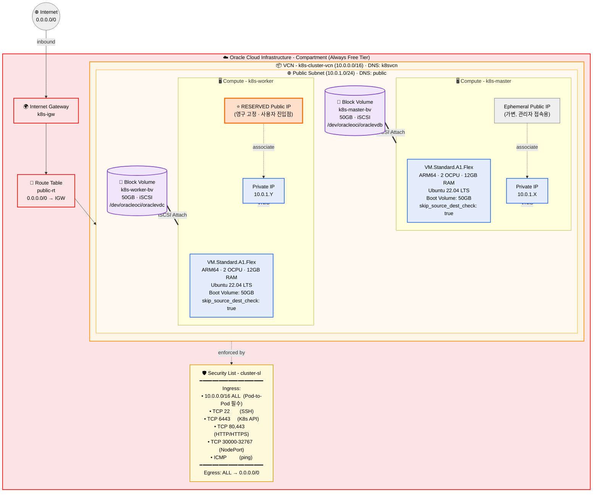
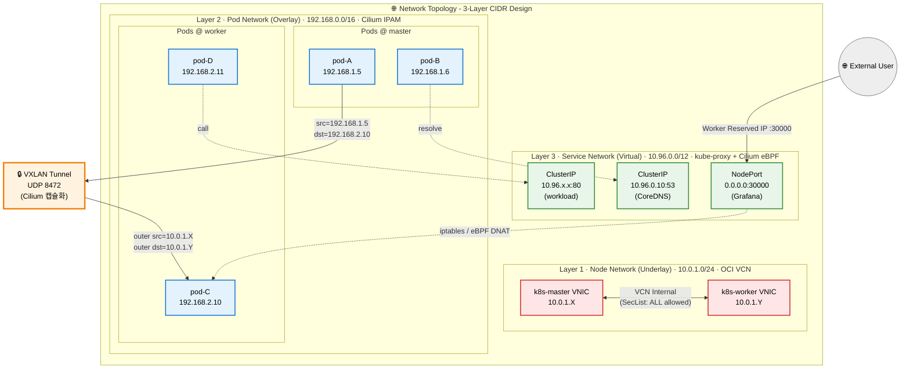
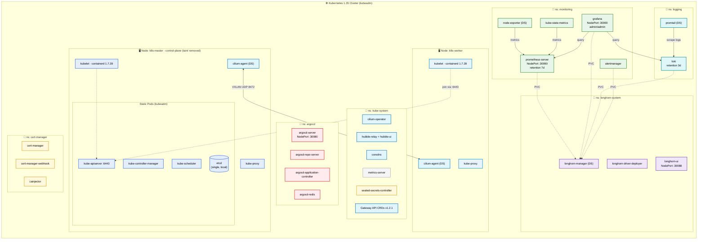
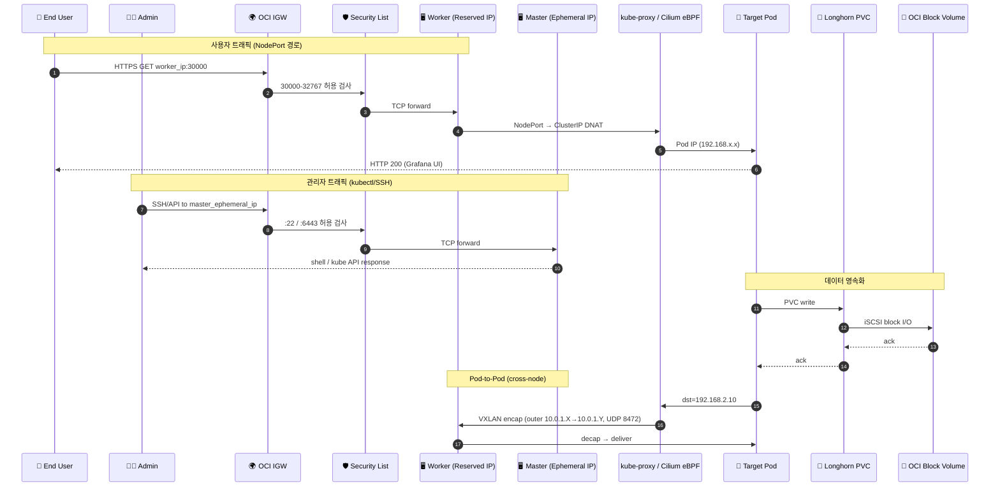

# OCI Kubernetes Production Cluster

**Terraform + Ansible 기반 프로덕션급 Kubernetes 클러스터 자동화**

[](https://www.terraform.io/)
[](https://www.ansible.com/)
[](https://kubernetes.io/)
[](https://www.oracle.com/cloud/free/)

Oracle Cloud Infrastructure에서 Terraform과 Ansible을 활용한 프로덕션급 Kubernetes 클러스터 완전 자동 구축.

---

## 🎯 특징

- ⚡ **원클릭 배포**: 인프라부터 애드온까지 완전 자동화
- � **분산 스토리지**: Longhorn으로 PVC 동적 프로비저닝
- �📊 **Observability**: Prometheus, Grafana, Loki 기본 탑재
- 🚀 **GitOps Ready**: ArgoCD로 즉시 CD 파이프라인 구축
- 💰 **프리티어**: OCI Free Tier 범위 내 무료 운영

---

## 📦 기술 스택

### **인프라 (Terraform)**
- VCN + Subnet + Security List
- Compute Instances (ARM64 Ampere A1)
- Block Volumes (Longhorn 백엔드 스토리지)
- Reserved Public IP

### **Kubernetes 기본**
- **Runtime**: containerd 1.7.28
- **Kubernetes**: v1.35.2
- **CNI**: Cilium v1.19.1 (eBPF, VXLAN tunnel, Hubble UI)
- **Gateway API**: v1.2.1

### **애드온 스택**
| 카테고리 | 컴포넌트 | 버전 | 용도 |
|---------|---------|------|------|
| 📦 Package | Helm | 3.x | 패키지 관리 |
| 💾 Storage | Longhorn | v1.7.2 (chart 1.7.2) | 분산 블록 스토리지 / 기본 StorageClass |
| 📊 Monitoring | kube-prometheus-stack | chart 79.9.0 | 메트릭 수집/시각화 |
| 📋 Logging | Loki + Promtail | loki-stack chart 2.10.3 | 로그 수집/조회 |
| 🔄 GitOps | ArgoCD | v2.13.2 | 선언적 배포 |
| 🔐 Secrets | Sealed Secrets | chart 2.17.9 (app 0.33.1) | 암호화된 Secret 관리 |
| 🔒 TLS | Cert-Manager | v1.16.2 | 인증서 자동화 |
| 📈 Metrics | Metrics Server | v0.7.2 | kubectl top 지원 |

---

## 🏗️ 아키텍처

### **인프라 구성도 (Terraform)**

OCI 리소스 전체 토폴로지 — Terraform이 한 번에 프로비저닝하는 모든 객체를 보여줍니다.



### **네트워크 토폴로지 (3-Layer CIDR + VXLAN Overlay)**

노드/Pod/Service 3계층 네트워크가 어떻게 분리되고 Cilium VXLAN으로 연결되는지를 표현합니다.



### **Kubernetes 컴포넌트 토폴로지 (Ansible)**

Ansible이 클러스터에 설치하는 모든 컴포넌트를 네임스페이스 단위로 정리한 그림입니다.



---

## 🏗️ 프로젝트 구조

```
oci-k8s-production/
├── terraform/                          # 인프라 프로비저닝
│   ├── provider.tf                     # OCI Provider 설정
│   ├── variables.tf                    # 변수 정의
│   ├── terraform.tfvars                # 변수 값 (직접 생성)
│   ├── main.tf                         # VCN, Compute, Volume 리소스
│   └── outputs.tf                      # Ansible 인벤토리 자동 생성
│
├── ansible/                            # 구성 관리
│   ├── inventory/
│   │   ├── hosts.ini                   # Terraform이 자동 생성
│   │   └── group_vars/
│   │       ├── all.yml                 # 전역 변수 (버전 관리)
│   │       ├── k8s_master.yml          # Master 노드 변수
│   │       └── k8s_workers.yml         # Worker 노드 변수
│   │
│   ├── roles/                          # 15개 Role
│   │   ├── common/                     # 시스템 기본 설정
│   │   ├── containerd/                 # Container Runtime
│   │   ├── kubernetes/                 # kubeadm, kubelet, kubectl
│   │   ├── k8s-master/                 # Master 노드 초기화
│   │   ├── k8s-worker/                 # Worker 노드 조인
│   │   ├── cilium/                     # Cilium CNI (VXLAN, Hubble)
│   │   ├── gateway-api/                # Gateway API CRDs
│   │   ├── helm/                       # Helm 패키지 매니저
│   │   ├── longhorn/                   # Longhorn 분산 스토리지
│   │   ├── monitoring/                 # Prometheus + Grafana
│   │   ├── logging/                    # Loki + Promtail
│   │   ├── argocd/                     # ArgoCD GitOps
│   │   ├── sealed-secrets/             # Sealed Secrets
│   │   ├── cert-manager/               # Cert-Manager
│   │   └── metrics-server/             # Metrics Server
│   │
│   └── playbooks/
│       ├── site.yml                    # 초기 배포 (전체)
│       └── upgrade.yml                 # 버전 업그레이드
│
├── scripts/
│   ├── deploy.sh                       # 초기 배포 자동화
│   ├── upgrade.sh                      # 업그레이드 자동화
│   └── destroy.sh                      # 클러스터 삭제
│
└── docs/
    └── components.md                   # 컴포넌트 상세 설명
```

---

## 🔄 배포 파이프라인

`./scripts/deploy.sh` 한 번 실행으로 아래 흐름이 자동 진행됩니다.

```mermaid
flowchart LR
    classDef tf fill:#623CE4,stroke:#341E90,color:#fff,stroke-width:2px
    classDef ans fill:#EE0000,stroke:#990000,color:#fff,stroke-width:2px
    classDef sh fill:#4EAA25,stroke:#2A6314,color:#fff,stroke-width:2px
    classDef art fill:#F5F5F5,stroke:#666,color:#000

    USER([👤 Operator]):::art
    DEPLOY[/"./scripts/deploy.sh"/]:::sh

    subgraph TF["Terraform Phase"]
        direction TB
        TF1["terraform init"]:::tf
        TF2["terraform apply"]:::tf
        TF3["VCN · Subnet · IGW<br/>SecList · RouteTable"]:::tf
        TF4["Compute Instances<br/>Master + Worker(s)"]:::tf
        TF5["Block Volumes + iSCSI Attach"]:::tf
        TF6["Reserved Public IP (Worker)"]:::tf
        TF7[/"hosts.ini 자동 생성<br/>(inventory.tpl)"/]:::art
        TF1 --> TF2 --> TF3 --> TF4 --> TF5 --> TF6 --> TF7
    end

    WAIT[["⏱ sleep 60s<br/>(인스턴스 부팅)"]]:::sh

    subgraph ANS["Ansible Phase"]
        direction TB
        A1["ansible-galaxy collection install<br/>(kubernetes.core, community.general)"]:::ans
        A2["site.yml 실행"]:::ans
        A3["Stage 1 · all nodes<br/>common · containerd · kubernetes"]:::ans
        A4["Stage 2 · master<br/>kubeadm init · taint 제거"]:::ans
        A5["Stage 3 · workers<br/>kubeadm join"]:::ans
        A6["Stage 4 · master (kubectl)<br/>cilium · helm · gateway-api"]:::ans
        A7["Stage 5 · master<br/>longhorn · monitoring · logging"]:::ans
        A8["Stage 6 · master<br/>argocd · sealed-secrets<br/>cert-manager · metrics-server"]:::ans
        A1 --> A2 --> A3 --> A4 --> A5 --> A6 --> A7 --> A8
    end

    DONE([✅ Production K8s Cluster Ready]):::art

    USER --> DEPLOY
    DEPLOY --> TF1
    TF7 --> WAIT
    WAIT --> A1
    A8 --> DONE
```



---

## 🚀 빠른 시작

### **1. 사전 준비**
```bash
terraform version  # >= 1.0
ansible --version  # >= 2.14
```

### **2. OCI 설정**
`terraform/terraform.tfvars` 생성:
```hcl
# OCI 인증
tenancy_ocid     = "ocid1.tenancy.oc1..aaaaaaa******************"
user_ocid        = "ocid1.user.oc1..aaaaaaa******************"
fingerprint      = "aa:bb:cc:dd:ee:ff:00:11:22:33:44:55:66:77:88:99"
private_key_path = "/path/to/oci_api_key.pem"
region           = "ap-chuncheon-1"  # 또는 ap-seoul-1

compartment_ocid = "ocid1.tenancy.oc1..aaaaaaa******************"
ssh_public_key   = "ssh-rsa AAAAB3NzaC1yc2EAAAADAQABAAABAQC******************"

# 클러스터 설정
cluster_name     = "k8s-prod"
master_count     = 1
worker_count     = 1

# 인스턴스 사양 (프리티어 최대)
instance_ocpus   = 2
instance_memory  = 12
```

**📌 OCI 정보 확인**:
- **Tenancy/User/Compartment OCID**: OCI Console → Profile → Tenancy/User Settings
- **Fingerprint**: Profile → API Keys → Add API Key
- **Private Key**: API Key 생성 시 다운로드한 `.pem` 파일 경로
- **SSH Public Key**: `ssh-keygen -t ed25519` 로 생성 후 `.pub` 파일 내용

### **3. 초기 배포 (처음 클러스터 구축)**

#### **3-1. Terraform으로 인프라 생성**
```bash
cd terraform
terraform init
terraform apply -auto-approve
```

#### **3-2. Block Volume 연결 (수동 필수)**

Terraform이 Block Volume을 생성하지만, iSCSI 연결은 각 노드에서 수동으로 해야 합니다.

**각 노드에 SSH 접속 후:**
```bash
# OCI Console → Compute → Instances → Attached Block Volumes
# → iSCSI Commands and Information 복사 후 실행

# 예시:
sudo iscsiadm -m node -o new -T <IQN> -p <IP>:3260
sudo iscsiadm -m node -o update -T <IQN> -n node.startup -v automatic
sudo iscsiadm -m node -T <IQN> -p <IP>:3260 -l

# 확인
lsblk  # /dev/sdb 등으로 보임
```

> 📌 **중요**: Master와 Worker 모두 실행해야 Longhorn이 디스크를 인식합니다. Longhorn이 raw block device를 직접 사용하므로 포맷/마운트는 불필요합니다.

#### **3-3. Ansible로 클러스터 구축**
```bash
cd ../ansible
ansible-playbook playbooks/site.yml
```

**예상 소요 시간**: 약 20-30분

### **4. 접속**
```bash
# Master (Ephemeral IP - OCI 콘솔에서 확인)
ssh ubuntu@<master-ip>

# Worker (Reserved IP - 고정)
ssh ubuntu@$(terraform output -raw primary_worker_ip)

# kubeconfig
mkdir -p ~/.kube
scp ubuntu@<master-ip>:/home/ubuntu/.kube/config ~/.kube/config
kubectl get nodes
```

> 💡 Master는 Ephemeral IP로 인스턴스 재시작 시 변경될 수 있습니다. Worker는 Reserved IP로 고정되어 애플리케이션 접근에 사용됩니다.

---

## 🔀 트래픽 플로우

외부 사용자/관리자 요청이 클러스터 내부 Pod에 도달하기까지의 경로입니다.



---

## 📊 서비스 접속

배포 완료 후 NodePort를 통해 접속:

| 서비스 | URL | 계정 | 비밀번호 확인 |
|--------|-----|------|-------------|
| **Grafana** | `http://<worker-ip>:30000` | admin | `kubectl get secret -n monitoring prometheus-grafana -o jsonpath='{.data.admin-password}' \| base64 -d` |
| **Prometheus** | `http://<worker-ip>:30090` | - | 인증 없음 |
| **ArgoCD** | `https://<worker-ip>:30080` | admin | `kubectl -n argocd get secret argocd-initial-admin-secret -o jsonpath='{.data.password}' \| base64 -d` |
| **Longhorn UI** | `http://<worker-ip>:30088` | - | 인증 없음 |

> 💡 모든 서비스는 Worker 노드의 Reserved IP로 접속합니다.

---

## 🔧 관리

### **클러스터 버전 업그레이드**

`ansible/inventory/group_vars/all.yml` 에서 원하는 버전으로 변경:

```yaml
kubernetes_version: "1.36"           # k8s 버전
cilium_chart_version: "1.20.0"       # Cilium
longhorn_chart_version: "1.8.0"      # Longhorn
prometheus_chart_version: "80.0.0"   # Prometheus
# ... 기타 애드온
```

업그레이드 실행:
```bash
./scripts/upgrade.sh
```

> ⚠️ 업그레이드 중 워크로드가 일시적으로 재스케줄링됩니다 (약 15-20분 소요)

### **Longhorn 스토리지 확인**

```bash
# Longhorn UI에서 Node 탭 확인
# http://<master-ip>:30088

# 인식된 디스크 확인
kubectl get nodes -o json | jq '.items[].metadata.name'
```

> Longhorn은 `/dev/sdb` 같은 raw block device를 자동으로 인식하고 사용합니다.

### **Sealed Secret 생성**
```bash
# 클러스터 공개키로 암호화
kubectl create secret generic mysecret \
  --dry-run=client --from-literal=password=mysecretpassword -o yaml | \
  kubeseal -o yaml > mysealedsecret.yaml

# Git에 커밋 후 ArgoCD가 자동 배포
```

### **클러스터 삭제**
```bash
cd terraform && terraform destroy -auto-approve
```

> ⚠️ Block Volume의 모든 데이터가 영구 삭제됩니다. 중요 데이터는 사전 백업 필수.

---

## 📈 리소스 (OCI Free Tier)

### **컴퓨트**
| 노드 | Shape | OCPU | Memory | 합계 |
|------|-------|------|--------|------|
| Master × 1 | VM.Standard.A1.Flex | 2 | 12GB | - |
| Worker × 1 | VM.Standard.A1.Flex | 2 | 12GB | - |
| **총합** | - | **4 / 4** | **24GB / 24GB** | ✅ 프리티어 한도 |

### **스토리지**
| 리소스 | 크기 | 개수 | 합계 |
|--------|------|------|------|
| Boot Volume | 50GB | 2 | 100GB |
| Block Volume (Longhorn) | 50GB | 2 | 100GB |
| **총합** | - | **4** | **200GB / 200GB** ✅ |

> OCI Free Tier는 Boot + Block Volume 합계 200GB 제공

### **네트워크**
| 리소스 | 사용 | 한도 |
|--------|------|------|
| VCN | 1 | 2 |
| Reserved Public IP | 1 (Worker) | 1 |
| Ephemeral Public IP | 1 (Master) | 무제한 (무료) |
| 아웃바운드 전송 | - | 10TB/월 |

**IP 할당 전략:**

클러스터 내부 통신은 Private IP (10.0.1.x)를 사용하므로 Public IP 변경은 클러스터 안정성에 영향을 주지 않습니다.

- **Master 노드**: Ephemeral IP (무료)
  - Control Plane API (6443) 및 관리 접근용
  - 클러스터 내부 통신은 Private IP 사용
  - IP 변경 시 kubeconfig 업데이트 필요 (관리자만 영향)
  
- **Worker 노드**: Reserved IP (프리티어 1개 무료)
  - 애플리케이션 엔드포인트로 사용
  - NodePort 서비스의 안정적인 외부 노출
  - DNS A 레코드 설정 가능 (도메인 연결)
  - 사용자 접근 URL 고정 (데모/공유 환경에 유리)

**월 예상 비용: $0** (프리티어 한도 내 완전 무료)

